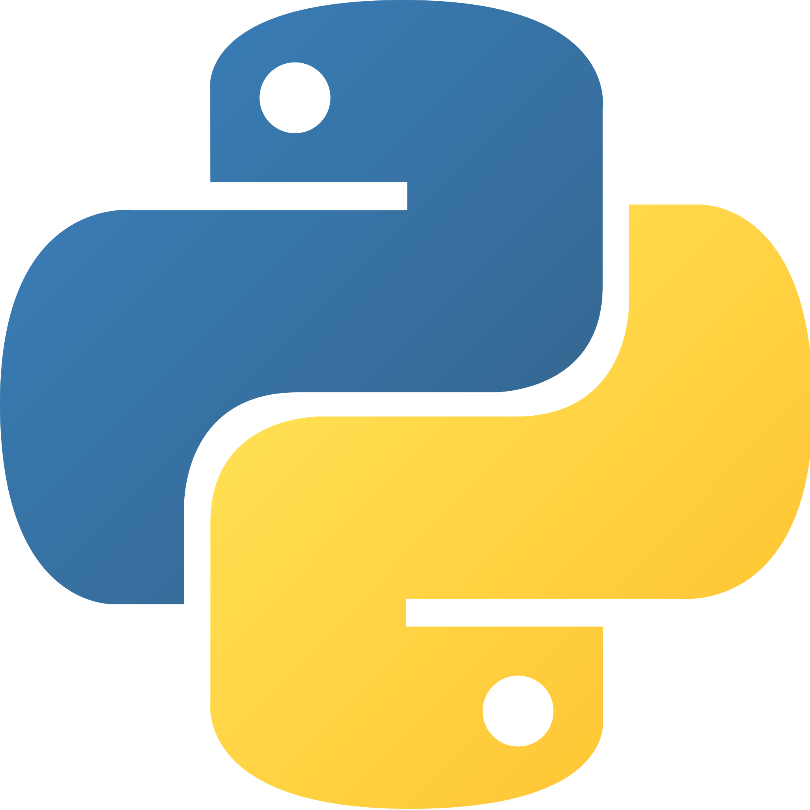

<!-- Social icons section -->
<h1 align="center"> Social Media</h1>
  

    
    
    
  

</h1>

<!-- Description about me -->
<h2 align="center"> 🤔 About me 👨‍💻 </h2>

# 👋 Hey, I'm Allen Y!  

- 🏗 **Product Engineer (Backend) at UST**  
- 💻 **Tech Stack:** Python, GraphQL, MongoDB, GCP  
- 🛠 **1.5+ years of experience** in backend development  
- 🚀 Passionate about building new things & learning emerging technologies  
- 🤝 Open to collaboration & contributing to open-source projects
- 📫 How to reach me **alleny244@gmail.com**
- ⚡ Fun fact  **It’s all 0’s and 1’s**

 

<!-- languajes and skills section -->
<h1 align="left"> Programming Languages</h1>

  <code></code>
  <code></code>
  <code></code>
  <code></code>
   <code></code>
   <code></code>

 

<h1 align="left">Technologies/Frameworks</h1>

  <code></code>
  <code></code>
  <code></code>
  <code></code>
  <code></code>
  <code></code>
   <code></code>
  <code></code>
  <code></code>
  <code></code>
  <code></code>
  <code></code>
   <code></code>
  <code></code>
     
    
  <code></code>
  <code></code>
   <code></code>
  <code></code>
  <code></code>
  <code></code>
  <code></code>
   <code></code>
  <code></code>
   <code></code>
     <code></code>
  <code></code>
  <code></code>
     
    
   <code></code>
   <code></code>
   <code></code>
   <code></code>
  <code></code>
  <code></code>

 

<h1 align="left"> Environments</h1>

  <code></code>
  <code></code>
  <code></code>
  <code></code>
  <code></code>

 
<h1 align="left"> Languages/Frameworks I'm learning: </h1>

  <code></code>

 

 

<!-- GitHub stats section -->

## 📊 Github stats

